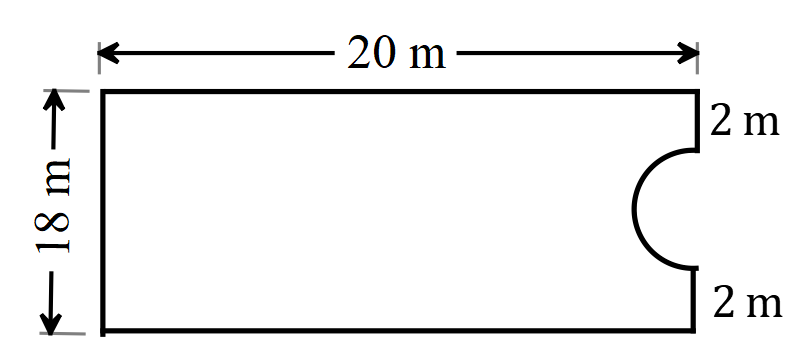
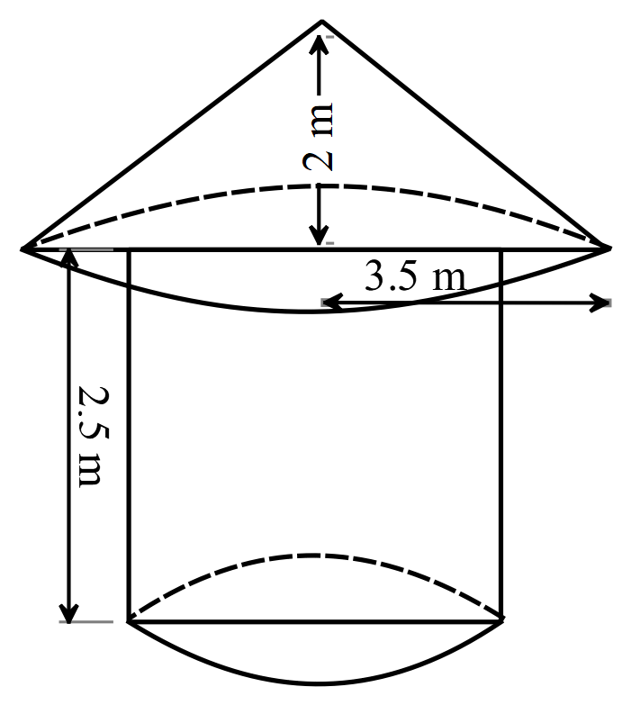
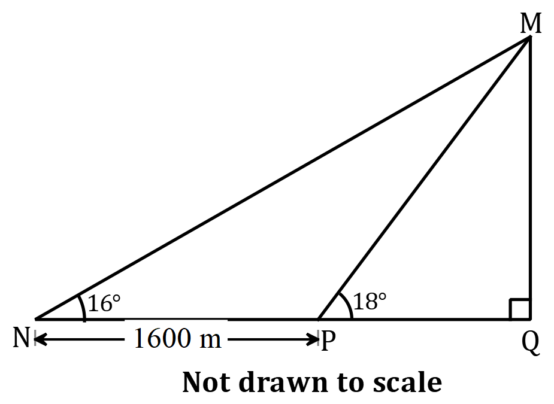

# YEARLY PAST QUESTIONS {-}


<!---------------- SSSCE 1993 STARTS HERE ----------------->  

## SSSCE 1993 {-}

<!--------------------- QUESTION 1 ------------------------>   

**Question 1:**

Without using tables or calculators, evaluate

a. $\displaystyle\frac{20.3}{3.5 \times 0.58}$
b. $53.8^2-46.2^2$
c. $\displaystyle\frac{2\frac{7}{8} \times 1\frac{1}{5}}{8-2\frac{1}{4}}$


<!--------------------- QUESTION 2 ------------------------>    

**Question 2:**

In a Senior Secondary School, there are 174 students in form 2. Of these, 86 play table tennis, 84 play football and 94 play volleyball; 30 play table tennis and volley ball, 34 play volley and football and 42 play table tennis and football. Each student play at least one of the three games and $x$ students play all the three games.

a. Display these facts in a Venn diagram.
b. Write down an equation in $x$ and hence find $x$.
c. If a student is chosen at random from form 2, what is the probability that he plays two games?

  
  
  
  
  
  


<!--------------------- QUESTION 3 ------------------------>    

**Question 3:** 

The cost $(c)$ of producing a motor car in a certain factory is partly constant and partly varies inversely as the number $(n)$ of cars produced per day. The cost of producing 4 cars per day is 1,600 dollars and that of producing 5 cars per day is 1,420 dollars. Find the relation between $c$ and $n$. Find the number of cars produced per day necessary to bring the cost down to 1,150 dollars per day.


<!--------------------- QUESTION 4 ------------------------>   

**Question 4:**

$A(4, 7)$ is the vertex of the triangle $ABC$. $\overrightarrow{BA}=\begin{pmatrix} 5\\3 \end{pmatrix}$ and $\overrightarrow{AC}=\begin{pmatrix} 4\\-3 \end{pmatrix}$.

a. Find the co-ordinate of $B$ and $C$.
b. If $M$ is the mid-point of line $BC$, find $\overrightarrow{AM}$. 


<!--------------------- QUESTION 5 ------------------------>   

**Question 5:**

In the diagram, $ABC$ is right-angled triangle in a horizontal ground. $\overline{AD}$ is a vertical tower. $\angle BAC=90^\circ, \angle ACB=35^\circ, \angle ABD=52^\circ$ and $|BC|=44$ m. Find

a. the height of the tower
b. the angle of elevation of the top of the tower from $C$.

```{r  echo=FALSE, fig.align='center', out.width='38%'}

```


   

<!--------------------- QUESTION 6 ------------------------>   

**Question 6:**

Use a ruler and a pair of compasses only for the following constructions:

a. Construct triangle $ABC$ in which $|AB|=10$ cm, $|BC|=6$ cm and angle $ABC=45^\circ$.

b. Locate the point $D$ inside the triangle $ABC$ such that $D$ is equidistant from $AB$ and $AC$, and 5 cm from $B$.

c. Construct a straight line through $D$ to cut $AB$ at $X$ and $AC$ at $Y$ such that $\overline{AX}=\overline{AY}$.

d. Measure $|AY|.$


<!--------------------- QUESTION 7 ------------------------>   

**Question 7:**

a. Use logarithm tables to calculate $\sqrt[3]{0.4276}$.

b. The development budget of a district council includes expenditure on feeder roads, schools and water supply. The expenditure on roads, schools and water supply are in the ratio $7:15:2$. If the expenditure on roads is 28 million cedis, find the expenditure on
    i. schools.
    ii. water supply.
    iii. What is the total budget for these three projects?
    iv. The cost of maintaining libraries is 900,000.00 cedis and this is met from the expenditure on schools. What percentage correct to 3 significant figures, of the expenditure on schools is spent on maintaining libraries?


<!--------------------- QUESTION 8 ------------------------>   

**Question 8:**

The relation for the volume $y$ of a tray of depth $x$ cm is given as $y=x(12-x)(8-x)$ cm$^3$. 

a. Copy and complete the following table of values of $x(12-x)(8-x)$. 

| $x$    |  0   |  1   |  2   |  3   |  4   |  5   |  6   |  7   |  8   |
| :----- | :--: | :--: | :--: | :--: | :--: | :--: | :--: | :--: | :--: |
| $12-x$ |  12  |  11  |      |  9   |  8   |      |  6   |      |  4   |
| $8-x$  |  8   |  7   |  6   |  5   |      |  3   |      |  1   |  0   |
| $y$    |  0   |  77  |      | 135  |      |      |      |      |  0   |
   
    
b. Use the table of values to draw the graph of $y=x(12-x)(8-x)$ from $x=0$ to $x=8$, taking 2 cm to 1 unit on the $x$-axis and 2 cm to 2 units on the $y$-axis.

c. What value of $x$ gives the maximum volume of the tray?

    
    
    
    


<!--------------------- QUESTION 9 ------------------------>   

**Question 9:**

```{r  echo=FALSE, fig.align='center', out.width='49%'}

```	

The diagram shows a belt $QRST$ round a shaft $R$ (of negligible radius) and a pulley of radius 0.6 m. $O$ is the center of the pulley, $|OR|=1.5$ m and the straight portion $QR$ and $RS$ of the belt are tangents at $Q$ and $S$ to the pulley. Calculate

a. angle $QOS$, correct to the nearest degree.
b. the total length of the belt $(QRST)$ to the nearest metre. $[\text{Take}\pi =3.142 ]$


<!--------------------- QUESTION 10 ------------------------>   

**Question 10:**

Using a scale of 2 cm to 2 units on each axis, draw on a sheet of graph paper two perpendicular axes $OX$ and $OY$, for intervals $-10\le x \le 10$ and $-10\le y \le 10$. 

a. Draw $\bigtriangleup ABC$ with coordinates $A(6, 8), B(2, 5)$ and $C(7, 2)$.

b. Draw the image $\bigtriangleup A^\prime B^\prime C^\prime$ of $\bigtriangleup ABC$ under an enlargement with scale factor $-1$ from the origin where $A\to A^\prime, B\to B^\prime$ and $C\to C^\prime$. Label the vertices and coordinates clearly.

c. Draw the image $\bigtriangleup A^{\prime\prime} B^{\prime\prime} C^{\prime\prime}$ of $\bigtriangleup ABC$ under a clockwise rotation of $270^\circ$ about the origin where $A\to A^{\prime\prime}, B\to B^{\prime\prime}$ and $C\to C^{\prime\prime}$. Label the vertices and coordinates clearly.

d. i. What transformation maps $\bigtriangleup A^\prime B^\prime C^\prime$ of $\bigtriangleup A^{\prime\prime} B^{\prime\prime} C^{\prime\prime}$
    ii. What is the equation of $BB^\prime$?
    


<!--------------------- QUESTION 11 ------------------------>   

**Question 11:**

The table gives the distribution of the ages (in years) of all persons (to the nearest thousand) in a town who were under the age of 40 years on 30$^\text{th}$ June, 1990.

| Age             | $0-4$ | $5-9$ | $10-14$ | $15-19$ | $20-24$ | $25-29$ | $30-34$ | $35-39$ |
| :-------------- | :---: | :---: | :-----: | :-----: | :-----: | :-----: | :-----: | :-----: |
| No. in thousand |   2   |   3   |    6    |   15    |   12    |    7    |    4    |    1    |

a. Using the table, calculate
    i. the total number of persons under 20 years.
    ii. the total number of persons between 15 and 30 years.

  b. i. Prepare a cumulative frequency table and use it to draw the cumulative frequency curve.
      ii. Use the curve to find the median age of the distribution.


<!--------------------- QUESTION 12 ------------------------>   

**Question 12:**

12. A sector of area 427 cm$^2$ is cut out from a thin circular metal sheet of radius 17 cm. It is then folded, with the straight edges coinciding to form a cone. Calculate, correct to three significant figures:
  a. the angle of the sector.
  b. the length of the arc of the sector.
  c. the height of the right circular cone.
  d. the volume of the cone. (Take $\pi=$ 3.142)


<!---------------- SSSCE 1994 STARTS HERE ----------------->  

## SSSCE 1994 {-}

<!--------------------- QUESTION 1 ------------------------> 

**Question 1:**

Without using calculator,

a. evaluate $\displaystyle\frac{2x-y}{z}+\displaystyle\frac{z+2y}{x}$, when $x=2, y=-3$ and $z=4$.

b. find $Q$ if $3Q+13^2=16^2$

  
  
  
  
  
  
<!--------------------- QUESTION 2 ------------------------> 

**Question 2:**

a. Multiply $2102_\text{three}$ by $122_\text{three}$ and leave the answer in base three.

b. i. Copy and complete the following table for multiplication modulo 7 on the set $\{1, 2, 3, 6\}$.
    ii. Use the table to find the truth set of $n\otimes n\otimes 6=5$.

| $\otimes$ |  1   |  2   |  3   |  6   |
| :-------- | :--: | :--: | :--: | :--: |
| 1         |  1   |  2   |  3   |  6   |
| 2         |  2   |  4   |  6   |      |
| 3         |  3   |      |  2   |  4   |
| 6         |  6   |  5   |      |      |

  

 


<!--------------------- QUESTION 3 ------------------------> 

**Question 3:**
   
a. The universal set $U=\{2, 3, 5, 7\}, P=\{2, 5\}$ and $Q=\{5, 7\}$. Find
    i. $(P\cap U)^\prime$ 
    ii. $P^\prime \cup Q^\prime$ 
    
    State the relationship between i. and ii.
  
b. In a class of 50 students, 30 offer Economics,  17 offer government and 7 offer neither Economics nor Government. How many students offer both subjects?

   
  
  
  
  
<!--------------------- QUESTION 4 ------------------------> 

**Question 4:**

a. Evaluate $\sqrt{7}\left(3\sqrt{7}+\displaystyle\frac{6}{\sqrt{7}} \right)$.

b. Find the truth set of the simultaneous equation. $\displaystyle\frac{5}{6}x-\displaystyle\frac{3}{4}y=2; \, \displaystyle\frac{1}{2}x-\displaystyle\frac{2}{3}y=\displaystyle\frac{5}{2}$

  
  
  
  
  
<!--------------------- QUESTION 5 ------------------------> 

**Question 5:** 

$X, Y$ and $Z$ are such that $X$ varies directly as $Z$ and inversely as the cube root of $Y$. If $X=8, Y=27$ and $Z=4$, find

a. an expression for $X$ in terms of $Y$ and $Z$.
b. the value of $Y$ when $X=12$ and $Z=10$.


   
  
<!--------------------- QUESTION 6 ------------------------> 

**Question 6:** 

$OABCD$ is a right square pyramid with vertex $O$, such that $|OA|=|OB|=|OC|=|OD|=30$ m and $|AB|=25$ m. Calculate:

a. the height of the pyramid
b. the volume of the pyramid
c. the angle between $OA$ and $AC$.
d. the total surface area of the pyramid (excluding the base).

   
  
  
  
  
<!--------------------- QUESTION 7 ------------------------> 

**Question 7:**  

The marks obtained by 40 students in an examination are as follows:

|  63  |  76  |  87  |  61  |  78  |  85  |  77  |  87  |  74  |  77  |
| :--: | :--: | :--: | :--: | :--: | :--: | :--: | :--: | :--: | :--: |
|  80  |  77  |  74  |  88  |  72  |  78  |  79  |  89  |  85  |  90  |
|  77  |  70  |  81  |  69  |  75  |  78  |  73  |  86  |  83  |  91  |
|  69  |  96  |  65  |  88  |  84  |  74  |  84  |  81  |  83  |  75  |


| Class Boundaries | Tally | Frequency $(f)$ | Class Midpoint $(x)$ |   $fx$    |
| :--------------- | :---: | :-------------: | :------------------: | :-------: |
| $59.5-64.5$      |       |                 |         $62$         |           |
| $64.5-69.5$      |       |                 |         $67$         |           |
| $69.5-74.5$      |       |                 |                      |           |
| $74.5-79.5$      |       |                 |                      |           |
| $79.5-84.5$      |       |                 |                      |           |
| $84.5-89.5$      |       |                 |                      |           |
| $89.5-94.5$      |       |                 |                      |           |
| $94.5-99.5$      |       |       $1$       |         $97$         |   $97$    |
|                  |       |    $\sum f$     |                      | $\sum fx$ |

a. Copy and complete the table.
b. i. Using the relation $x=\frac{\sum fx}{\sum f}$ or otherwise, find the mean, $\overline{x}$.
    ii. Calculate the probability that a student chosen at random obtain at least 75 marks.
c. Draw a histogram using the frequency table.


   
  


<!--------------------- QUESTION 8 ------------------------> 

**Question 8:**  

a. Using a scale of 2 cm to 2 units on both axes, draw on a sheet of graph paper two perpendicular axes, $Ox$ and $Oy$ for the intervals $-10\le x \le 10$ and $-10\le y \le 10$.
    
b. Draw on the same graph sheet, clearly labelling the vertices and indicating the co-ordinates,

    i. triangle $PQR$ with $P(2, 2),\overrightarrow{PQ}=\begin{pmatrix} 2\\4\end{pmatrix}$ and $\overrightarrow{QR}=\begin{pmatrix} 2\\-4\end{pmatrix}$.
    
    ii. the image triangle $P^\prime Q^\prime R^\prime$ of triangle $PQR$ under a reflection in the line $x=0$, where $P\to P^\prime, Q\to Q^\prime$ and $R\to R^\prime$.
    
    iii. the image of $P^{\prime\prime} Q^{\prime\prime} R^{\prime\prime}$ of triangle $PQR$ under a rotation of $180^\circ$ about the origin, where $P\to P^{\prime\prime}, Q\to Q^{\prime\prime}$ and $R\to R^{\prime\prime}$.

c. i. Describe the single transformation that maps  triangle $P^\prime Q^\prime R^\prime$ onto the triangle $P^{\prime\prime} Q^{\prime\prime} R^{\prime\prime}$ where $P^\prime\to P^{\prime\prime}, Q^\prime\to Q^{\prime\prime}$ and $R^\prime \to R^{\prime\prime}$.
   
   ii. Find $\overrightarrow{P^\prime R^\prime}$.
    
    
  


<!--------------------- QUESTION 9 ------------------------> 

**Question 9:** 

Using a ruler and a pair of compasses only,

a. construct $\bigtriangleup PRQ$ such that $|PQ|=9$ cm, $\angle PQR=75^\circ$ and $\angle QPR=60^\circ$.
b. locate a point $T$, inside $\bigtriangleup PRQ$ such that it is equidistant from $\overline{RQ}, \overline{RP}$ and $\overline{PQ}$.
c. construct the circle which touches the three sides of $\bigtriangleup PRQ$ and measure its radius.


   
  
<!--------------------- QUESTION 10 ------------------------> 

**Question 10:**  

Kofi and Yaw entered into a business partnership with a total capital of 81 million cedis. They are agreed to contribute the capital in the ratio 2:1 respectively. The profit was shared as follows:

Kofi was paid $5\%$ of the total profit for his service as the manager. Each partner was paid $3\%$ of the capital invested. The remainder of the profit was then shared between them in the ratio of their contribution to the capital. If Kofi's share of the total profit was 7.5 million cedis, calculate

a. the total profit for the year to the nearest thousand cedis.
b. Yaw's share of the profit as a percentage of his contribution to the capital.


   
  
<!--------------------- QUESTION 11 ------------------------> 

**Question 11:** 

a. Copy and complete the following table for the relation $y=3+2x-x^2$ for $-2\le x \le 4$.
    
| $x$  | $-2$ | $-1$ | $0$  | $1$  | $1.5$ | $2$  | $2.5$  | $3$  | $3.5$ | $4$  |
| :--: | ---- | :--: | :--: | :--: | :---: | :--: | :----: | :--: | :---: | :--: |
| $y$  |      | $0$  | $3$  |      |       |      | $1.75$ |      |       | $-5$ |

    
b. Taking 2 cm as 1 unit on both axes, draw the graph of the relation for the given interval.
c. Draw on the same axes the graph of $x-y=0$.
d. Using your graphs,
    i. solve the equation $3+2x-x^2=x$.
    ii. find the value of $x$ for which $3+2x-x^2=2$.
    
    
    
   
  
<!--------------------- QUESTION 12 ------------------------> 

**Question 12:** 

a. A village $P$ is 10 km from a lorry station, $Q$ on a bearing of $065^\circ$. Another village $R$ is 8 km from $Q$ on a bearing of $155^\circ$, calculate:
    i. the distance of $R$ from $P$ to the nearest kilometre.
    ii. the bearing of $R$ from $P$ to the nearest degree.

b. $M$ is a village on $\overline{PR}$ such that $\overline{QM}$ is perpendicular to $\overline{PR}$. Find the distance of $M$ from $P$ to the nearest kilometre.


<!---------------- SSSCE 1995 STARTS HERE ----------------->  

## SSSCE 1995 {-}

<!--------------------- QUESTION 1 ------------------------> 

**Question 1:**

Without using calculator or table evaluate

a. $\displaystyle\frac{0.0045\times 0.81}{0.0027\times 0.004}$, leaving your answer in standard form;

b. $2\sqrt{5}(6-2\sqrt{5}),\,\, \sqrt{5}=2.236$

  
  
  
  
<!--------------------- QUESTION 2 ------------------------> 

**Question 2:**

a. Copy and complete the following tables for addition $\oplus$ and $\otimes$ modulo 5.
	

| $\oplus$ |  0   |  1   |  2   |  3   |  4   |
| :------- | :--: | :--: | :--: | :--: | :--: |
| 0        |  0   |  1   |  2   |  3   |  4   |
| 1        |  1   |  2   |  3   |  4   |  0   |
| 2        |  2   |      |  4   |      |  1   |
| 3        |  3   |  4   |  0   |  1   |      |
| 4        |  4   |  0   |  1   |  2   |      |

| $\otimes$ |  0   |  1   |  2   |  3   |  4   |
| :-------- | :--: | :--: | :--: | :--: | :--: |
| 0         |  0   |  0   |  0   |  0   |  0   |
| 1         |  0   |  1   |  2   |  3   |  4   |
| 2         |  0   |  2   |  4   |      |      |
| 3         |  0   |  3   |  1   |      |  2   |
| 4         |  0   |  4   |      |  2   |      |

	
    
b. From the tables, find
    i. $(2 \otimes 4)\oplus 4$
    ii. $(4 \oplus 4)\otimes 2$
  
   
   

<!--------------------- QUESTION 3 ------------------------> 

**Question 3:**

In a class of 32 students, 18 offer Chemistry, 16 offer Physics and 22 offer Mathematics, 6 offer all the three subjects, 3 offer Chemistry and Physics only and 5 offer Physics only. Each student offers at least one subject. Find the number of students who offer

a. Chemistry only;
b. only one subject;
c. only two subjects. 

  


<!--------------------- QUESTION 4 ------------------------> 

**Question 4:**

A man deposited 80,000.00 cedis in a bank at $12\%$ compound interest per annum. Find his total amount at the end of the third year.

  
  
  
  
<!--------------------- QUESTION 5 ------------------------> 

**Question 5:** 

A ship sails from Port $R$ on a bearing $065^\circ$ to Port $S$ a distance of 54 km. It then sails on a bearing of $155^\circ$ from Port $S$ to Port $Q$, a distance of 80 km. Find, correct to one decimal place

a. the distance between $R$ and $Q$.
b. the bearing of $Q$ from $R$.

   
   
   
   
  
<!--------------------- QUESTION 6 ------------------------> 

**Question 6:**

Jones bought a car for 6,800,000.00 cedis. He later put it up for sale at 8,800,000.00 cedis. He agreed to sell it to Ruby under the following hre purchase terms:

An initial payment of $20\%$ of the price and the balance paid at $15\%$ simple interest per annum in twelve monthly equal installments. Calculate

a. the amount paid every month.
b. the total amount Ruby paid for the car.
c. the percentage profit Jones made on the cost of the car.


  
  
  
<!--------------------- QUESTION 7 ------------------------> 

**Question 7:**

a. Using ruler and a pair of compasses only, construct
    i. triangle $ABC$, where $|AB|=7$ cm, $|AC|=8$ cm and $\angle A=105^\circ$;
    ii. $X$, the locus of the point 6 cm from $C$
    iii. $Y$, the locus of the points equidistant from $\overline{AB}$ and $\overline{BC}$ to cut $X$ in $P$ and $R$.
    
b. Measure
    i. $BC$
    ii. $PR$
    
  


<!--------------------- QUESTION 8 ------------------------> 

**Question 8:**

a. The resistance, $R$ to the motion of a car is partly constant and partly varies as the square of the speed $V$. When the car is moving at 30 kmh$^{-1}$, the resistance is 630 N and at 50 kmh$^{-1}$, the resistance is 950 N. Find 
    i. an expression for $R$ in terms of $V$;
    ii. the distance at 80 kmh$^{-1}$
  
b. Solve for $x$ in $3\log_{10} x+\log_{10} 3=\log_{10} 81$    

  
  
  
  
  
  
<!--------------------- QUESTION 9 ------------------------> 

**Question 9:**

a. The coordinates of the vertices of a parallelogram $QRST$ are $Q(1,6), R(2, 2), S(5, 4)$ and $T(x, y)$.
    i. Find the vectors $\overrightarrow{QR}$ and $\overrightarrow{TS}$ and hence determine the values of $x$ and $y$.
    ii.  Calculate the magnitude of $\overrightarrow{RS}$.
    iii. Express $\overrightarrow{RS}$ in the form $(k, \theta)$, where $k$ is the magnitude and $\theta$ is the bearing.

b. Find the values of $x$ and $y$ in the equation $\begin{pmatrix} x+3\\2 \end{pmatrix} - \begin{pmatrix} y\\x+y \end{pmatrix}=\begin{pmatrix} 2\\-1 \end{pmatrix}$.    
  
   
   
   
  
<!--------------------- QUESTION 10 ------------------------> 

**Question 10:**

Using a scale of 2 cm to 2 units in each axis, draw on a sheet of graph paper two perpendicular axes $Ox$ and $Oy$ for the intervals $-8 \leq x \leq 12$ and $-12 \leq y \leq 12$.

a. Draw $\bigtriangleup ABC$ with coordinates $A(5, 7), B(3, 4)$ and $C(7, 3)$.
    
b. Draw the image of $\bigtriangleup A^\prime B^\prime C$ of $\bigtriangleup ABC$ under translation by the vector $\begin{pmatrix}[r] 4\\-2 \end{pmatrix}$ where $A \to A^\prime, B \to B^\prime$ and $C \to C^\prime$.
    
c. Draw the image of $\bigtriangleup A^{\prime\prime} B^{\prime\prime} C^{\prime\prime}$ under the reflection in the line $y=-2$, where $A \to A^{\prime\prime}, B \to B^{\prime\prime}$ and $C \to C^{\prime\prime}$.
    
d. Draw the image of $\bigtriangleup A^{\prime\prime\prime} B^{\prime\prime\prime} C^{\prime\prime\prime}$ under rotation through $90^\circ$ anticlockwise about the origin where $A \to A^{\prime\prime\prime}, B \to B^{\prime\prime\prime}$ and $C \to C^{\prime\prime\prime}$.
    
e. Find the gradient of the line $B^{\prime\prime} B^{\prime\prime\prime}$

   
   
   
   
   
  
<!--------------------- QUESTION 11 ------------------------> 

**Question 11:**

The table below shows the distribution of marks of candidates in an examination.

| Marks   | Frequency | Marks less than | Cumulative frequency |
| :------ | :-------: | :-------------: | :------------------: |
| $0-9$   |    $4$    |      $9.5$      |                      |
| $10-19$ |    $7$    |     $19.5$      |                      |
| $20-29$ |    $5$    |     $29.5$      |                      |
| $30-39$ |   $10$    |                 |                      |
| $40-49$ |   $13$    |                 |                      |
| $50-59$ |   $20$    |                 |                      |
| $60-69$ |   $15$    |                 |                      |
| $70-79$ |   $13$    |                 |                      |
| $80-89$ |    $5$    |                 |                      |
| $90-99$ |    $1$    |                 |                      |

Copy and complete the table

a. Draw a cumulative frequency curve for the distribution.
b. Use your curve to estimate
    i. the median
    ii. the probability that a student chosen at random obtained at least 75 marks.

   
  


<!--------------------- QUESTION 12 ------------------------> 

**Question 12:**

a. The diagram shows a circle $PQRS$ with centre $O$. The relfex angle at $O$ is $204^\circ, \angle ORS=54^\circ$ and $\angle OPS=x^\circ$. Find $x$.

```{r  echo=FALSE, fig.align='center', out.width='38%'}

```  
   
b. A solid cube of side 8 cm was melted to form a solid circular cone. The base radius of the cone is 4 cm. Calculate, correct to one decimal place, the height of the cone.$\left[\text{Take} \pi =\frac{22}{7} \right]$


<!---------------- SSSCE 1996 STARTS HERE ----------------->  

## SSSCE 1996 {-}

<!--------------------- QUESTION 1 ------------------------> 

**Question 1:**

Mathematics, English and Life Skills books were distributed to 50 students in a class. 22 had Mathematics books, 21 had English books and 25 Life Skills books, 7 had Mathematics and English books, 6 had Mathematics and Life Skills books and 9 had English and Life Skills books. Find the number of students who had

a. all the three books
b. exactly two of the books
c. only Life Skills books


  
<!--------------------- QUESTION 2 ------------------------> 

**Question 2:** 

The table below shows the number of students who offer certain subjects in a school

| Subject     | No. of students |
| :---------- | :-------------: |
| Mathematics |       45        |
| Physics     |       39        |
| Chemistry   |       28        |
| Biology     |       14        |
| Economics   |       36        |
| History     |       18        |

a. Draw a pie chart to illustrate the data.
b. What percentage of students offer Economics.


 

<!--------------------- QUESTION 3 ------------------------> 

**Question 3:**  

```{r  echo=FALSE, fig.align='center', out.width='33%'}

```  

In the diagram $P,Q$ and $R$ are points on the circle with centre $O$, diameter 14 cm and $\angle PRQ=35^\circ$. Find, correct to one decimal place,

a. the length of the minor arc $PQ$;
b. the chord $PQ$. (Take $\pi =  3.142$)


   
  
  
  
  
<!--------------------- QUESTION 4 ------------------------> 

**Question 4:**  

The force of attraction, $F$, btween two bodies varies directly as the product of their masses, $M$ and $m$ and inversely as the square of the distance, $d$, between them. Given that $F=20$ N when $M=25$ kg, $m=$ 10 kg and $d=$ 5 m. Find

a. an expression for $F$ in terms of $M, m$ and $d$.
b. the distance, $d$, when $F=30$ N, $M=7.5$ kg and $m=4$ kg.


  
  
<!--------------------- QUESTION 5 ------------------------> 

**Question 5:**   

a. Find $\theta$, if $\cos (\theta +60^\circ)=0.0872$, where $0^\circ \leq \theta \leq 90^\circ$.

b. A vertical pole $AB$ is erected on a level ground. A man 1.7 m tall stands at $C$, 24 m away from the foot, $B$ of the pole. The angle of elevation of the top, $A$ of the pole from the man is $54^\circ$. Calculate, correct to one decimal place, the height of the pole.


   
  
<!--------------------- QUESTION 6 ------------------------> 

**Question 6:**   

a. The value of a printing  machine depreciated each year by $8\%$ of its value at the beginning of that year. If the value of a new machine is 54 million cedis, find its value at the end of the third year.
    
b. Three friends Ato, Oko and Edem entered into a business partnership. They contributed 3.0 million, 2.4 million and 3.6 million cedis respectively. It was agreed that the profits will be shared in the proportion to their contributions. After one year of operation the profit made was 2.7 million cedis.
    i. Find the amound received by eached partner as his share of the profit.
    ii. Express Edem's share of the profit as a percentage of his investment.

   
  


<!--------------------- QUESTION 7 ------------------------> 

**Question 7:**  

a. Copy and complete the following table for the relation $y=x^2+x+6$ in the interval $-5 \leq x \leq 4$. 

| $x$  | $-5$ | $-4$ | $-3$ | $-2$ | $-1$ | $0$  | $1$  | $2$  | $3$  | $4$  |
| :--- | ---- | ---- | :--: | :--: | :--: | :--: | :--: | :--: | :--: | :--: |
| $y$  |      | $6$  |      | $-4$ |      |      |      | $-4$ |      | $6$  |  
    
b. Using a scale of 2 cm to 1 unit on the $x$-axis and 2 cm to 2 units on the $y$-axis, draw the graph of the relation for $-5 \leq x \leq 4$.

c. Use your graph to find
    i. the equation of the line of symmetry
    ii. the truth set of $x^2+x=8$ 
    iii. the coordinates of the minimum point.
  
  
   
  
  
  
  
<!--------------------- QUESTION 8 ------------------------> 

**Question 8:**   

a. If $\textbf{a}=\begin{pmatrix} 1\\-3 \end{pmatrix}, \textbf{b}=\begin{pmatrix} 2\\3 \end{pmatrix}$ and $\textbf{c}=\begin{pmatrix} 8\\3 \end{pmatrix}$, find
    i. $m$ and $n$ such that $\textbf{c}=m \textbf{a}+n\textbf{b}$, where $m$ and $n$ are scalars.
      ii. $|\textbf{d}|$ if $\textbf{d}=\textbf{c}-2\textbf{a}$.
    
b. Find the image of $(3, -7)$ under the transformation $\begin{pmatrix} x\\y \end{pmatrix} \to \begin{pmatrix} 2x+y\\y-3x \end{pmatrix}$.

   
  


<!--------------------- QUESTION 9 ------------------------> 

**Question 9:** 

a. i. Express $\displaystyle\frac{\sqrt{2}+\sqrt{5}}{\sqrt{10}}$ in the form $a\sqrt{5}+b\sqrt{2}$, where $a$ and $b$ are rational numbers.

   ii. Simplify $( 6+2\sqrt{5} ) \left( 3-\displaystyle\frac{1}{\sqrt{5}} \right)$

b. Find the three consecutive odd integers such that the sum of the last two is 15 less than 5 times the first.
    
    
  
<!--------------------- QUESTION 10 ------------------------> 

**Question 10:**  

a. Using a scale of 2 cm to 2 units on both axes, draw on a sheet of graph paper two perpendicular axes $Ox$ and $Oy$ for $-10 \leq x \leq 10$ and $-10 \leq y \leq 10$.
    
b. Draw on the same graph paper indicating clearly the coordinates of all vertices 
    i. the quadrilateral $ABCD$ with $A(2, 2), B(6, 2)$, $ C(8, 8)$ and $D(4, 8)$.
    ii. the image $A_1 B_1 C_1 D_1$ of quadrilateral $ABCD$ under a reflection in the line $x=0$ where $A \to A_1, B \to B_1, C \to C_1$ and $D \to D_1$.
    iii. the image $A_2 B_2 C_2 D_2$ of quadrilateral $ABCD$ under a rotation through $180^\circ$ about the origin, where $A \to A_2, B \to B_2, C \to C_2$ and $D \to D_2$.
    iv.  the image $A_3 B_3 C_3 D_3$ of quadrilateral $ABCD$ under a reflection in the line $y=2$, where $A \to A_3, B \to B_3, C \to C_3$ and $D \to D_3$.

c. Find the equation of the line $DD_1$.

 
  

<!--------------------- QUESTION 11 ------------------------> 

**Question 11:**  

The table below shows the distribution of marks obtained by students in an examination.
 
| Marks    | Frequency |
| :------- | :-------: |
| $11-20$  |     5     |
| $21-30$  |    21     |
| $31-40$  |    15     |
| $41-50$  |    43     |
| $51-60$  |    10     |
| $61-70$  |    14     |
| $71-80$  |     7     |
| $81-90$  |     3     |
| $91-100$ |     2     |

a. Draw a histogram to represent the above data
b. Use your histogram to estimate the mode
c. Find the class that contains the median mark
d. If a student is chosen at random, find the probability that he obtains a mark between 41 and 90.


   
  
<!--------------------- QUESTION 12 ------------------------> 

**Question 12:**  

A circle has a radius of 7.5 cm. A sector with an angle of $240^\circ$ is cut out from the circle.

a. Find the length of the arc of the sector
b. If the sector is folded to form a cone, find, correct to one decimal place
    i. the radius of the cone
    ii. the height of the cone
    iii. the volume of the cone $\left[ \text{Take} = \frac{22}{7} \right]$


<!---------------- SSSCE 1997 STARTS HERE ----------------->  

## SSSCE 1997 {-}

<!--------------------- QUESTION 1 ------------------------> 

**Question 1:**

The sets $A=\{..., -6,-4,-2,0,2,4,6,...\}, B=\{ 0 \leq x \leq 9 \}$ and $C=\{x:-4 < x \leq 0 \}$ are subsets of $\mathbb{Z}$, the set of integers. 

a. i. Describe the members of the set $A^\prime$, where $A^\prime$ is the compliment of $A$.
    ii. Find $A^\prime \cap B$.
b. Represent the sets $B$ and $C$ on a Venn diagram.
  
  
  

<!--------------------- QUESTION 2 ------------------------> 

**Question 2:**

Without using calculators or tables

a. simplify $\left( 1\displaystyle\frac{2}{7} - \displaystyle\frac{1}{3} \right)\times 1  \displaystyle\frac{3}{4}$;
b. evaluate $\displaystyle\frac{7.25 \times (0.16)^2}{0.004}$


 


<!--------------------- QUESTION 3 ------------------------> 

**Question 3:**

$P^\prime (8, -2)$ is the image of the point $P(5,2)$ by the translation vector $\textbf{v}$. Find 

  i. the vector $\textbf{v}$;
  ii. the coordinates of the point $Q$ which maps onto the point $Q^\prime(5, -2)$ under $\textbf{v}$.
  iii. $\overrightarrow{P^\prime Q^\prime}$;
  iv. $|P^\prime Q^\prime|$.


   
  
<!--------------------- QUESTION 4 ------------------------> 

**Question 4:**

If $3^m \times 3^n = 243$ and $3^m \div 3^{2n}=9$, write down two equations connecting $m$ and $n$. Hence, find the values of $m$ and $n$.


  
<!--------------------- QUESTION 5 ------------------------> 

**Question 5:**

Using ruler and a pair pair of compasses only, construct a triangle $ABC$ in which angle $A=45^\circ, |AB|=7$ cm and $|AC|=9$ cm. Locate a point $P$, inside the triangle $ABC$, 5 cm from $A$ and equidistant from $B$ and $C$. Find $|PB|$.
   
  
<!--------------------- QUESTION 6 ------------------------> 

**Question 6:** 

a.
```{r  echo=FALSE, fig.align='center', out.width='40%'}

```  

In the figure, $TB$ touches the circle at $B$ and $BD$ is a diameter. $\angle TBA=31^\circ$ and $\angle BAC=69^\circ$. Calculate
    i. $\angle ADC$
    ii. $\angle ABC$
    iii. $\angle CAD$

b. In the triangle $ABC, |AB|=5$ cm, $|BC|=8$ cm and $|AC|=6$ cm. $P$ is a point on $AB$ such that $|AP|=2$ cm. The line through $P$ parallel to $BC$ meets $AC$ at $Q$. Calculate
    i. $|PQ|$;
    ii. $|QC|$.


   
  


  
<!--------------------- QUESTION 7 ------------------------> 

**Question 7:**  

a. The cost of a packet of sugar is $x$ cedis and the cost of of a tin of milk is $y$ cedis. If 3 packets of sugar and 4 tins of milk cost 635.00 cedis and 4 packets of sugar and 3 tins of milk cost 695.00 cedis, write two equations connecting $x$ and $y$. Hence, find $x$ and $y$.
    
b. The cost of production of a wireless set was 40,000.00. The manufacturer sold it to a wholesaler at a profit of 20 percent. the wholesaler also sold it at a profit of 25 percent. The retailer marked the set to be sold at a price 50 percent above what he paid for it.
    i. Find the marked price
    ii. To a customer who paid cash, the retailer reduced the price to 75,000.00 cedis. Find the percentage discount.

   
  


<!--------------------- QUESTION 8 ------------------------> 

**Question 8:** 

a. Without using tables or calculator, evaluate $3\sqrt{7}(7-2\sqrt{7})$, if $\sqrt{7}=2.646$.
    
b. The cost or producing a motor car in a certain factory is partly constant and partly varies inversely as a number of cars produced per day. If the cost of producing each car is 1,600 dollars when 4 cars are produced per day and 1,420 dollars when 5 cars are produced per day, find the rate of production necessary to bring the cost down to 1,150 dollars per car.

  
   
  
<!--------------------- QUESTION 9 ------------------------> 

**Question 9:**

The table below shows the heights, measured to the nearest metre, of 300 trees.

| Height(m)    | 2    | 3    | 4    | 5    | 6    | 7    | 8    | 9    |
| :----------- |:----:|:----:|:----:|:----:|:----:|:----:|:----:|:----:|
| No. of trees | 14   | 21   | 42   | 83   | 118  | 12   | 7    | 3    |

a. Draw a histogram to represent the data.
b. Calculate the mean of the distribution, correct to the nearest metre.
c. If a tree is selected at random, find the probability that is is at least 6 metres tall.


  
<!--------------------- QUESTION 10 ------------------------> 

**Question 10:**

a. Copy and complete the following table of values for the relation $y=\displaystyle\frac{2x(x-1)}{x+3}$, for the interval $-1 \leq x \leq 6.$
    
| $x$       | $-1$ | $0$  | $0.5$   | $1$  | $2$  | $3$  | $4$    | $5$  | $6$    |
| :-------- |:----:|:----:|:-------:|:----:|:----:|:----:|:------:|:----:|:------:|
| $2x(x-1)$ |      | $0$  | $-0.5$  | $0$  | $4$  |      | $24$   | $40$ | $60$   |
| $x+3$     | $2$  |      | $3.5$   | $3$  |      |      | $7$    |      | $9$    |
| $y$       |      |      | $-0.14$ | $0$  |      |      | $3.43$ |      | $6.67$ |
    
b. Using a scale of 2 cm to 1 unit on both axes, draw the graph of $y=\displaystyle\frac{2x(x-1)}{x+3}$ for th given interval.

c.  Use your graph to
    i. find the range of values of $x$ for which $y$ is negative.
    ii. estimate, correct to one decimal place, the value of $x$ for which $2x(x-1)=x+3$.

   
  
  
  
<!--------------------- QUESTION 11 ------------------------> 

**Question 11:**

a. Using a scale of 2 cm to 2 units on both axes, draw on a graph sheet two perpendicular axes $Ox$ and $Oy$ for $-10 \leq x \leq 10$ and $-10 \leq y \leq 10$.
    
b. Draw, labeling all the vertices clearly together with their coordinates,
    i. triangle $ABC$ with vertices $A(4, 8), B(1, 7)$ and $C(3, 4)$.
    ii. the image $\bigtriangleup A_1 B_1 C_1$ of $\bigtriangleup ABC$ under a reflection in the line $y=3$, where $A \to A_1, B \to B_1 $ and $C \to C_1$.
    iii. the image $\bigtriangleup A_2 B_2 C_2$ of $\bigtriangleup ABC$ under an anticlockwise rotation through $90^\circ$ about the origin, where $A \to A_2, B \to B_2 $ and $C \to C_2$.
    iv. the image $\bigtriangleup A_3 B_3 C_3$ of $\bigtriangleup ABC$ under an enlargement with scale factor $-1$ from the origin, where $A \to A_3, B \to B_3 $ and $C \to C_3$.
    v. What single transformation maps $\bigtriangleup A_2 B_2 C_2$ onto $\bigtriangleup A_3 B_3 C_3$.

  


<!--------------------- QUESTION 12 ------------------------> 

**Question 12:**

The model below shows the pyramid $EFGHV$ on a cuboid $ABCDEFGH. |AB|=6$ cm, $|BC|=6$ cm and $|CG|=2$ cm. 

```{r  echo=FALSE, fig.align='center', out.width='33%'}

```  

The volume of the model is 132 cm$^3$. Find, correct to the nearest whole number,

a. the height of the pyramid
b. the length of the slant edge, $VG$;
c. the angle between the face $VFG$ and the base $EFGH$. [Take $\pi$ = 3.142]


<!---------------- SSSCE 1998 STARTS HERE ----------------->  

## SSSCE 1998 {-}

<!--------------------- QUESTION 1 ------------------------> 

**Question 1:**

a. Consider the following statements
    
    $S:$ All students with measles stay in the sick bay.
    
    $T:$ All students in the sick bay do not do homework.
    
    Which of the following is/are valid deductions from the two statements?
    
    i. Kofi does not have measles so Kofi does his homework.
    ii. George has done his homework therefore he does not stay in the sick bay.
    iii. jane does not have measles so she does not stay in the sick bay.
    
b. Solve the equation $243_x =73$ where $x$ is the base of the number.


<!--------------------- QUESTION 2 ------------------------> 

**Question 2:**

a. Simplify $\displaystyle\left(\displaystyle\frac{27}{64}\right)^{-\frac{2}{3}}$.
b. Solve the inequality $4x+3 \leq 3(2x-1)$. Illustrate your answer on the number line.


 


<!--------------------- QUESTION 3 ------------------------> 

**Question 3:**

a. If $C=216k$, find the least integral value of $k$ that will make $C$ a perfect square.
    
b. In the diagram, $WXYZ$ is a circle with centre $O$. $XZ$ and $WY$ intersect at $V$. $\angle XOY = 110^\circ$ and $\angle YVZ=100^\circ$. Calculate
    i. $\angle XZY$
    ii. $\angle WXZ$

```{r  echo=FALSE, fig.align='center', out.width='33%'}

```  

  

   
  


<!--------------------- QUESTION 4 ------------------------> 

**Question 4:**

If $t=\sqrt{\displaystyle\frac{p-r}{p+r}}$, find

a. $r$ in terms of $p$ and $t$.
b. the value of $r$, when $t=3$ and $p=10$.

  
  


<!--------------------- QUESTION 5 ------------------------> 

**Question 5:**

```{r  echo=FALSE, fig.align='center', out.width='38%'}

```  

The diagram above represents a rectangular compound 20 m by 18 m with a semi-circular portion cut off. Calculate

a. the perimeter of the compound
b. the area of the compound. $\left[\text{Take } \pi = \frac{22}{7} \right]$

 
  


<!--------------------- QUESTION 6 ------------------------> 

**Question 6:**

a. If $3x-4=2(y-2)$, find $\displaystyle\frac{x}{y}$, where $y \neq 0$.
b. Use logarithm tables to evaluate $\displaystyle\frac{86.19 \times (0.0462)^2}{\sqrt{0.846}}$


<!--------------------- QUESTION 7 ------------------------> 

**Question 7:**

```{r  echo=FALSE, fig.align='center', out.width='36%'}

```  

The diagram above shows a circle $PQRS$ with centre $C$. Quadrilateral $CPSR$ is a rhombus $\angle QPC = \angle CRQ = x$ and $\angle PQR = q$.

a. Find
    i. $q$
    ii. $x$
    iii. $\angle QRS$
    
b. Show that triangle $PQR$ is an equilateral triangle.


   
  
<!--------------------- QUESTION 8 ------------------------> 

**Question 8:**

The table below shows the expenditure pattern of a family in 1993. The net income of the family for 1993 was 1.8 million cedis.

| Item                                    | Percentage |
| :-------------------------------------- | :--------: |
| Food                                    |     60     |
| Clothing and footwear                   |     22     |
| Rent, transport and household equipment |     7      |
| Education, entertainment and recreation |     7      |
| Miscellaneous goods and services        |     4      |

a. Calculate the amount the family spent on
    i. food
    ii. miscellaneous goods and services
    
b. The family's income for 1994 increased by $35\%$. At the same time expenditure for food recorded an increase of $20\%$. Find the amount the family saved at the end of 1994.


  
<!--------------------- QUESTION 9 ------------------------> 

**Question 9:**

a. Using a ruler and a pair of compasses only, construct
    i. a quadrilateral $ABCD$, where $|AB|=8$ cm, $|AD|=6$ cm, $|BC|=10$ cm, $\angle BAD=60^\circ$ and $\angle ADC=135^\circ$;
    ii. the locus, $l_1$ of points equidistant from $BC$ and $CD$;
    iii. the line, $l_2$, from $B$ perpendicular to $l_1$.

b. i. Locate $E$, the point of intersection of $l_1$ and $l_2$.
    ii. Measure $|AE|$ and $|DE|$.
    
    
    
  
<!--------------------- QUESTION 10 ------------------------> 

**Question 10:** 

a. Copy and complete the following table of values for the relation $y=10+6x-3x^2$ for $-3 \leq x \leq 5$.
    
| $x$  | $-3$ | $-2$ | $-1$ | $0$  | $1$  | $2$  | $3$  |  $4$  | $5$  |
| :--: | ---- | :--: | :--: | :--: | :--: | :--: | :--: | :---: | :--: |
| $y$  |      |      |      | $10$ | $13$ |      | $1$  | $-14$ |      |  
    
b. Using a scale of 2 cm to 1 unit n the $x$-axis and 2 cm to 5 units on the $y$-axis, draw the graph of the relation for the given interval.
    
c. From the graph, solve the equation
    i. $10+6x-3x^2=0$
    ii. $5+2x-x^2=0$

d. Find the equation of the axis of symmetry.


   
  
<!--------------------- QUESTION 11 ------------------------> 

**Question 11:** 

a. A ship sails due north from a point $P$ to a point $Q$, 4 km away. It then sails on a bearing of $090^\circ$ to a point $R$, 3 km from $Q$. Find the distance between $P$ and $R$.
    
b. Two points $A$ and $C$, on opposite sides of a vertical pole, are on the same level ground as the foot of the pole, $B$. The angles of elevation of the top of the pole $D$ from $A$ and $C$ are $30^\circ$ and $48^\circ$ respectively. If the distance between $A$ and $C$ is 50 m, find $|BD|$, the height of the pole.

  
   
  
<!--------------------- QUESTION 12 ------------------------> 

**Question 12:** 

Two fair dice, $A$ and $B$, each with faces numbered 1 to 6 are throw together.

a. Construct a table showing all the equally likely outcomes.

b. From your table, list the pair of numbers on the two dice for which the sum is
    i. 5
    ii. 10
    iii. more than 10
    iv. at least 10

c. Find the probability that the two dice shw
    i. different scores
    ii. same scores

d. Find the probability that the sum of the numbers on the two dice is
    i. 5
    ii. 10
    iii. more than 10
    iv. at least 10


<!---------------- SSSCE 1999 STARTS HERE ----------------->  

## SSSCE 1999 {-}

<!--------------------- QUESTION 1 ------------------------> 

**Question 1:**    

a. Consider the following two statements:
    
    $P:$ All students are hardworking
    
    $Q:$ No hardworking person is careless
	
	i. Draw a Venn diagram to illustrate the above statements.
    ii. Which of the following statements are valid or not valid conclusions from $P$ and $Q$?
    
  $\alpha$) Ama is a student $\Rightarrow$ Ama is not careless.
  
  $\beta$) Kwame is hardworking $\Rightarrow$ Kwame is a student.
  
  $\gamma$) Esi is careless $\Rightarrow$ Esi is not a student.

b. $A=\{ 1,2,3,4,6 \}$ and $B=\{ 1,2,3,6,9,18 \}$ are subsets of the universal set $\mu =\{ 1,2,3,4,6,9,12,18,36  \}$. List the elements of
    i. $A^\prime \cap B$
    ii. $(A^\prime \cap B)^\prime$
    
  
  


<!--------------------- QUESTION 2 ------------------------> 

**Question 2:**  

a. If $\displaystyle\frac{3m-n}{5m-n}=\displaystyle\frac{p}{q}$, express $m$ in terms of $p,q$ and $n$.

b. Without using tables and calculator, express $\displaystyle\frac{(0.00042\times 10^{-8})(15,000)}{(5000\times 10^7)(0.0021\times 10^{14})}$ in the form $a \times 10^n$, where $1<a<10$ and $n$ is an integer.

 


<!--------------------- QUESTION 3 ------------------------> 

**Question 3:**  

a. Copy and complete the multiplication, $\otimes$, table for modulo 8 on the set $\{ 2,3,4,5,6,7 \}$.
    
| $\otimes$ | 2    | 3    | 4    | 5    | 6    | 7    |
| :-------- |:----:|:----:|:----:|:----:|:----:|:----:|
| 2         | 4    | 6    | 0    | 2    | 4    | 6    |
| 3         | 6    |      | 4    |      | 2    | 3    |
| 4         | 0    | 4    |      | 4    | 0    | 4    |
| 5         |      | 7    | 4    | 1    |      | 3    |
| 6         | 4    | 2    | 0    | 6    | 4    |      |
| 7         | 6    |      | 4    |      | 2    | 1    |   
    
b. From your table, find
    i. the truth set of the equation $n \otimes n=1$
    ii. the value of $(3 \otimes 5)\otimes 6$

   
  
  
  
<!--------------------- QUESTION 4 ------------------------> 

**Question 4:**  

$A(-2,3), B(2, -1),C(5, 0)$ and $D(x, y)$ are the vertices of the parallelogram $ABCD$.

a. Find $\overrightarrow{AB}$ and $\overrightarrow{DC}$. Hence, find the coordinates of $D$.
b. Calculate, correct to one decimal place $|\overrightarrow{DB}|$.


  
  
  
  
<!--------------------- QUESTION 5 ------------------------> 

**Question 5:** 

Using a ruler and a pair of compasses only, construct

a. triangle $ABC$ with $|AB|=6$ cm, $|BC|=8$ cm and $\angle ABC=90^\circ$.
b. a point $D$ on $AC$, which is equidistant from $B$ and $C$.
c. Measure $|BD|$


  
  
  
<!--------------------- QUESTION 6 ------------------------> 

**Question 6:** 

a. Simplify $3\sqrt{27}-2\sqrt{3}(4\sqrt{3}-5\sqrt{12})$, leaving your answer in surd form.
b. A variable $y$ is partly constant and partly varies as the square of $x$. When $x=2, y=6$ and when $x=3, y=10$.
    i. Find the equation connecting $x$ and $y$.
    ii. Find the values of $x$ when $y=5$.
    iii. Find the values of $y$ when $x=4$.

   
   
   
  
<!--------------------- QUESTION 7 ------------------------> 

**Question 7:** 

a. In the diagram(not drawn to scale), $ABCD$ is a quadrilateral $\angle ABC=\angle ACD=90^\circ, |AB|=3$ cm, $|BC|=4$ cm and $|AD|=13$ cm. Find the area of the quadrilateral.

```{r  echo=FALSE, fig.align='center', out.width='42%'}

```  
    
    
    
b. In the diagram(not drawn to scale), $AB$ is a diameter if the circle $ABCD$. $DC$ is parallel to $AB$ and $\angle BAC=25^\circ$. Calculate
    i. $\angle ADC$
    ii. $\angle CAD$

```{r  echo=FALSE, fig.align='center', out.width='36%'}

```  
    
    
   
   
  
<!--------------------- QUESTION 8 ------------------------> 

**Question 8:**

In a certain country, the annual income tax payable by an individual is as follows

|       | _Amount(in cedis)_ | _Rate of Tax_ |
| :---: | :----------------: | :-----------: |
| First |      140,700       |   Free Tax    |
|   "   |      100,000       |      5%       |
|   "   |      150,000       |      15%      |
|   "   |      200,000       |      25%      |
|   "   |      300,000       |      35%      |
|   "   |      350,000       |      45%      |
|   "   |      400,000       |      55%      |

Mr. Hermosa's annual salary is 1,390,700.00 cedis. Calculate:

a. his taxable income
b. his annual income
c. the percentage of his income that went into tax, correct to two significant figures.

   
  
  
<!--------------------- QUESTION 9 ------------------------> 

**Question 9:** 

a. Copy and complete the table of values for the relation $y=x^2-2x-3$ for the interval $-2 \leq x \leq 4$.

| $x$  | $-2$ | $-1.5$ | $-1$ | $0$  | $1$  | $2$  | $2.5$ | $3$  | $3.5$ | $4$  |
| :--- | :---:|:------:| :--: | :--: | :--: | :--: | :---: | :--: | :---: | :--: |
| $y$  | $5$  |        |      | $-1$ |      |      |       | $0$  |       |      | 	    
    
b. Using a scale of 2 cm to 1 unit on both axes, draw the graph of of the relation $y=x^2-2x-3$ for the given interval.
c. Use your graph to find
    i. the solution of $x^2-2x-2=0$;
    ii. the equation of the line of symmetry;
    iii. the range of values of $x$ for which $y$ is negative.
  
   
   
   
  
<!--------------------- QUESTION 10 ------------------------> 

**Question 10:**

$A, B, X$ and $Y$ are four points in a horizontal plane. $B$ is on a bearing of $090^\circ$ from $A$. $X$ is 7.5 m due north of $B$ and on a bearing of $052^\circ$ from $A$. $Y$ is due north of $A$ and on a bearing of $340$ from $B$. calculate correct to three significant figures:

a. $|AB|$
b. $|AY|$
c. the components of $\overrightarrow{XY}$
d. the distance and bearing of $Y$ from $X$.


   
  
<!--------------------- QUESTION 11 ------------------------> 

**Question 11:**

The table below shows the height in millimetres of a sample of 250 seedlings on an experimental farm.

| Height of seedlings(mm) | $0-4$ | $5-9$ | $10-14$ | $15-19$ | $20-24$ | $25-29$ | $30-34$ | $35-39$ |
| :---------------------- | :---: | ----- | ------- | :-----: | :-----: | :-----: | :-----: | :-----: |
| No. of seedlings        |  40   | 45    | 60      |   40    |   30    |   21    |   10    |    5    |

a. Construct a cumulative frequency table and use it to draw a cumulative frequency curve for the sample.
b. Using your cumulative frequency curve, find
    i. the first and third quartiles
    ii. the percentage of the sample of seedlings whose heights are above 22 mm. 

   
  
  
  
  
<!--------------------- QUESTION 12 ------------------------> 

**Question 12:**

The diagram shows a hut made if a onical roof and a cylindrical wall. The height of the roof is 2 m and its base is 3.5 m. The cylindrical wall has a height of 2.5 m and base area  of 28.26 m$^2$.

```{r  echo=FALSE, fig.align='center', out.width='36%'}

```  

a. calculate, correct to three significant figures,
    i. the slant height of the conical roof
    ii. the surface area of the conical roof
    iii. the external surface area of the wall.

    
b. If the cost of painting a square metre surface is 450.00 cedis, calculate the total cost of painting the outer area of the wall and the roof of the hut. [Take $\pi$ = 3.14]


<!---------------- SSSCE 2000 STARTS HERE ----------------->  

## SSSCE 2000 {-}

<!--------------------- QUESTION 1 ------------------------> 

**Question 1:**   
  
The set $P=\{ \text{multiples of 3} \}, Q=\{ \text{factors of 72} \}$ and $R=\{ \text{even numbers} \}$ are the subsets of $U=\{ 18 \leq x \leq 36 \}$.

a. List the elements of $P,Q$ and $R$
b. Find
    i. $P \cap Q$
    ii. $Q \cap R$
    iii. $P \cap R$
c. What is the relationship between $P \cap Q$ and $Q \cap R$.
  
  
  
  
  
<!--------------------- QUESTION 2 ------------------------> 

**Question 2:**   

a. Find $R$, if $5R^2+(22.55)^2=(27.45)^2$.
b. Evaluate $\sqrt{1,500}+3\sqrt{3} \times 5\sqrt{5}+2\sqrt{15}(\sqrt{15} - 3)$ in the form $p+q\sqrt{15}$, where $p$ and $q$ are integers.

 


<!--------------------- QUESTION 3 ------------------------> 

**Question 3:**   

a. Solve the equation $\log (5x-4)=\log (x+1)+\log 4$
    
b. In the diagram above, $A,B,C$ and $D$ are points on a circle. $|AB|=|AC|, \angle BDC=50^\circ$ and $\angle ABD=30^\circ$. Calculate the value of $\angle CAD$.

```{r  echo=FALSE, fig.align='center', out.width='36%'}

```  
   
  
  
  
<!--------------------- QUESTION 4 ------------------------> 

**Question 4:**   

Given that $T=\displaystyle\frac{27V}{6V-5.4M}$.

a. Make $V$ the subject of the relation.
b. If $T=4.5$ and $M=7\times 10^7$, calculate the value of $V$, leaving your answer in standard form.


  
  
  
  
  
<!--------------------- QUESTION 5 ------------------------> 

**Question 5:**  

The table below shows the number of cars sold by a company from January to June 1990.


| January | February | March  | April |  May  | June  |
| :-----: | :------: | :----: | :---: | :---: | :---: |
|  7,100  |  7,668   | 10,366 | 9,940 | 8,236 | 7,810 |

a. Draw a pie chart to illustrate the information.
b. What is the percentage of cars sold in February?
  
   
  
  
  
  
<!--------------------- QUESTION 6 ------------------------> 

**Question 6:** 

a. Using a scale of 2 cm to 2 units on both axes, draw on a sheet of graph paper two perpendicular axes $Ox$ and $Oy$, for the intervals $-8 \leq x \leq 8$ and $-8 \leq y \leq 12$.
    
b. draw on the same graph sheet indicating clearly the coordinates of all vertices.
    i. the square $PQRS$ with coordinates $P(2,2), Q(6,2), R(6,6)$ and $S(2,6)$.
    ii. the image $P_1 Q_1 R_1 S_1$ of the square $PQRS$ under a reflection in the $y$-axis where $P \to P_1, Q \to Q_1, R \to R_1$ and $S \to S_1$.
    iii. the image $P_2 Q_2 R_2 S_2$ of the square $PQRS$ under a translation by the vector $\begin{pmatrix} 4\\-8 \end{pmatrix}$ where $P \to P_2, Q \to Q_2, R \to R_2$ and $S \to S_2$.
    iv. the image $P_3 Q_3 R_3 S_3$ of the square $PQRS$ under a rotation through $180^\circ$ about the origin where $P \to P_3, Q \to Q_3, R \to R_3$ and $S \to S_3$.
    
c. Find the vector $\overrightarrow{P_2 P_3}$.
  
   
  
  
  
<!--------------------- QUESTION 7 ------------------------> 

**Question 7:** 

a. The simple interest on 600,000.00 cedis for $3 \frac{3}{4}$ years is 56,250.00 cedis. Find the rate percent per annum.
b. Mr. Amos bought a car for 2.5 million cedis in 1985. He paid $40\%$ of the cost and paid the rest in equal monthly installments. He took 8 years to make full payment for the car. Interest was at $18\%$ simple interest. calculate
    i. the monthly installment.
    ii. the total amount he paid for the car.
    iii. the percentage increase in the cost of the car.
    
    
  
  
  
  
<!--------------------- QUESTION 8 ------------------------> 

**Question 8:** 

a. The cost $C$ of maintaining a household is partly constant and partly varies as the number of people $n$, in the house. For 8 people, the cost is 70,000 cedis and for 10 people, the cost is 90,000 cedis. Find
    i. an expression for $C$ in terms of $n$.
    ii. the weekly cost for 12 people
   
b. Two passengers trains, **A** and **B**, 300 km apart, starts towards each other at the same time. They meet after 2 hours. If train **B** travels $\frac{8}{7}$ as fast as train **A**, what is the speed of each train?


   
   
   
   
  
<!--------------------- QUESTION 9 ------------------------> 

**Question 9:** 

Using a ruler and a pair of compasses only,

a. Construct
    i. triangle $ABC$ such that $|AB|=8$ cm, $\angle BAC=105^\circ$ and $\angle ABC=30^\circ$.
    ii. the locus $l_1$ of points equidistant from $A$ and $B$.
    iii. the locus $l_2$ of points equidistant from $B$ and $C$.
b. Locate $P$, the point of intersection of $l_1$ and $l_2$.
c. Using $PC$ as radius, draw a circle.
d. Measure
    i. $|BC|$
    ii. the radius of the circle.
   
   
  
  
  
  
<!--------------------- QUESTION 10 ------------------------> 

**Question 10:**

a. The annual rent of a rectangular plot of land is 1,024,000.00 cedis at a rate of 320.00 cedis per square metre. If the length is 80 m, find the width of the plot.
    
b. A flower bed is in the form of a rectangle with semi-circular ends. The straight sides are 25 m long and the flower bes is 14 m wide.
    i. Find the area of the flower bed.
    ii. If the cost of black soil is 955.75 cedis per square metre and the cost of labour is 800.00 cedis per square metre, find the cost of covering the bed with black soil. $\left[\text{Take } \pi = \frac{22}{7} \right]$

   
  
  

<!--------------------- QUESTION 11 ------------------------> 

**Question 11:**   

The data below show the distribution of marks obtained by 50 students in a test.

|  10  |  73  |  19  |  78  |  24  |  34  |  34  |  35  |  78  |  35  |
| :--: | :--: | :--: | :--: | :--: | :--: | :--: | :--: | :--: | :--: |
|  37  |  59  |  41  |  63  |  41  |  65  |  45  |  55  |  55  |  58  |
|  48  |  49  |  49  |  53  |  53  |  55  |  45  |  55  |  65  |  67  |
|  58  |  38  |  59  |  43  |  61  |  44  |  48  |  68  |  79  |  83  |
|  70  |  14  |  74  |  29  |  76  |  31  |  48  |  68  |  85  |  90  |

a. Using class intervals of 10 - 19, 20 - 29 etc. construct frequency table for the distribution.
    
b. i. Draw a histogram for the distribution.
    ii. Use your histogram to estimate the mode.
c. Calculate the mean mark of the distribution.


   
  
  
  
  
<!--------------------- QUESTION 12 ------------------------> 

**Question 12:**

a. Four angles of a hexagon are $130^\circ, 160^\circ, 112^\circ$ and $80^\circ$. If the remaining angles are equal, find the size of each of them.
    
b. A ship sails from a point **A** in a direction $065^\circ$ to a point **B**, 24 km away. From **B**, the ship sails 18 km due east to a point **C**. From **C**, the ship then sails 30 km due north to a point **D**. Calculate the bearing of **D** from **A**. 


<!---------------- SSSCE 2001 STARTS HERE ----------------->  

## SSSCE 2001 {-}

<!--------------------- QUESTION 1 ------------------------> 

**Question 1:**     
  
a. If $P=\{ 1,2,3,4 \}$, write down all the subsets of $P$ which are exactly two elements.
b. $A=\{ \text{Prime numbers less than 15} \}$,
   $B=\{ \text{Even numbers less than 15} \}$ and 
    $C=\{ x: 3 \leq x < 12, \text{where} x \text{is an integer} \}$. List the elements of 
    i. $A \cap C$
    ii. $B \cap C$
    iii. $(A \cup B)^\prime C$
    
    


<!--------------------- QUESTION 2 ------------------------> 

**Question 2:**  

a. If $\sqrt{7}=2.646$, find without using calculator, the value of $\sqrt{0.0007}$.
b. Copy and complete the table below for addition base eight.

| $\oplus$ |  1   |  3   |  5   |  7   |
| :------- | :--: | :--: | :--: | :--: |
| 1        |  2   |  4   |  6   |      |
| 3        |      |  6   |  10  |  12  |
| 5        |  6   |      |      |      |
| 7        |      |  12  |  14  |  16  |
    
Use your table to solve the following:

  i. $3 \oplus x = 12$
  ii. $n \oplus n =6$
    
    


<!--------------------- QUESTION 3 ------------------------> 

**Question 3:**     
  
a. If $x^5=1024$, find the value of $x$.
b. Given that $\log_{10} 7=0.8451$ and $\log_{10} 3=0.4771$, find without using calculator, $\log_{10} \left( \displaystyle\frac{9}{7} \right)$.
  
  


<!--------------------- QUESTION 4 ------------------------> 

**Question 4:**  

a. Express $441_\text{five}$ as a number in base four. 
b. Solve the inequality $\displaystyle\frac{1}{3}x - \displaystyle\frac{1}{5}(2+x) \geq x + \displaystyle\frac{7}{3} $
  
  


<!--------------------- QUESTION 5 ------------------------> 

**Question 5:**     
  
A group of 300 Mathematics teachers were classified as follows:

| University Graduates | $120$ |
| :------------------- | :---: |
| Diplomats            | $90$  |
| Specialist           | $50$  |
| Others               |  $y$  |

a. Calculate the value of $y$.
b. Draw a pie chart to represent the above information.

   


<!--------------------- QUESTION 6 ------------------------> 

**Question 6:**  

a. $S=\displaystyle\frac{n}{2}[2a+(n-1)d]$, where $n>0.$ Find the value of $n$, if $a=3, d=4$ and $S=210$. 
b. Tickets for a film show were sold at 4,000 cedis per adult and 2,000 cedis per child. the total amount raised from the 500 tickets sold was 1,600,000 cedis. 
    i. Find the number of
    	   $\alpha$) Adults who bought tickets for the show.
    	    $\beta$) Children who bought tickets for the show.
    ii. $12\%$ of the amount raised was paid as taxed and $2\%$ of the amount raised was paid to the tickets sellers. Find the amount  paid
    	$\alpha$) as tax
    	$\beta$) to the tickets sellers
    	


<!--------------------- QUESTION 7 ------------------------> 

**Question 7:**     
  
a. Using a scale of 2 cm to 2 units on both axes,  draw on a sheet of graph paper two perpendicular axes $Ox$ and $Oy$ for the interval $-10 \leq x \leq 10$ and $-12 \leq y \leq 12$.
    
b. Draw on the same graph sheet, showing clearly the coordinates of all vertices,
    i. the triangle $PQR$ with $P(4, 8),\overrightarrow{QP} = \begin{pmatrix} -2\\2 	\end{pmatrix}$ and $\overrightarrow{RQ} = \begin{pmatrix} 2\\4 	\end{pmatrix}$.
    ii. the image $\bigtriangleup P_1 Q_1 R_1$ of $\bigtriangleup PQR$ under a reflection in the line $y=-2$, where $P \to P_1, Q \to Q_1$ and $R \to R_1$.
    iii. the image $\bigtriangleup P_2 Q_2 R_2$ of $\bigtriangleup PQR$ under a translation by the vector $\begin{pmatrix} -8\\2 	\end{pmatrix}$ where $P \to P_2, Q \to Q_2$ and $R \to R_2$.
    iv. the image $\bigtriangleup P_2 Q_2 R_2$ of $\bigtriangleup PQR$ under a rotation through $180^\circ$ about the origin.

c. Find $Q_2 Q_3$


<!--------------------- QUESTION 8 ------------------------> 

**Question 8:**  

```{r  echo=FALSE, fig.align='center', out.width='42%'}

```  


In the diagram, $C$ is the centre of the circle $PQRS, STQ$ and $PCQ$ are straight lines and $RS$ is parallel to $QP$. Angle $SPC=60^\circ$. 

a. Show that triangles $CQT$ and $RST$ are similar.
b. Find 
    i. $\angle RSQ$
    ii. $\angle CRQ$


<!--------------------- QUESTION 9 ------------------------> 

**Question 9:**  

a. Using a ruler and a pair of compasses only, construct
    i. $\bigtriangleup GBC$ with $\angle GBC=30^\circ, |BG|=12$ cm.
    ii. $l_1$, the locus of points 6 cm from C.
    iii. $l_2$, the perpendicular from $C$ to $BG$.

b. i. Locate $A$ and $D$, the intersection of $l_1$ and $BG$.
    ii. Measure $|AD|$ and $\angle ACD$.
    iii. Calculate, correct to two significant figures, the area of the minor sector $ACD$. [Take $\pi =$ 3.142]
    
    


<!--------------------- QUESTION 10 ------------------------> 

**Question 10:**     
  
The marks obtained in a test by 40 pupils are as follows:

|  78  |  60  |  78  |  66  | 33   |  81  |  67  |  84  |  72  |  60  |
| :--: | :--: | :--: | :--: | :---:| :--: | :--: | :--: | :--: | :--: |
|  54  |  42  |  27  |  33  | 24   |  66  |  27  |  63  |  18  |  30  |
|  39  |  44  |  30  |  30  | 33   |  45  |  39  |  33  |  30  |  45  |
|  27  |  36  |  42  |  18  | 42   |  36  |  60  |  72  |  72  |  63  | 


a. Construct a frequency table using the class intervals 10-19, 20-29, 30-39 etc.
b. Draw a histogram for the distribution taking 2 cm for the width of each bar and 2 cm to represent 2 pupils.
c. i. Use your histogram to estimate the mode.
   ii. Calculate the mean of the distribution.
    
    


<!--------------------- QUESTION 11 ------------------------> 

**Question 11:**  


```{r  echo=FALSE, fig.align='center', out.width='52%'}

``` 

The following diagram represent a field with a circular pond of diameter 14 m. $PTS$ and $QUR$ are semi-circles. $PQRS$ is a rectangle with $|PQ|=112$ m and $|QR|=56$ m. Find:

a. the distance round the field. 
b. the area of the field excluding the pond. $\left[ \text{Take } \pi=\frac{22}{7} \right]$


<!--------------------- QUESTION 12 ------------------------> 

**Question 12:**

a. If $\sin \theta = \displaystyle\frac{3}{5}$, find the value of $\tan \theta$.
b. A ladder 5 m long, leans against a vertical wall at an angle of $70^\circ$ to the ground. The ladder slips down the wall 2 m. Find, correct to two significant figures,
    i. the new angle which the ladder makes with the ground;
    ii. the distance the ladder slipped back on the ground from ts original position.


<!---------------- SSSCE 2002 STARTS HERE ----------------->  

## SSSCE 2002 {-}

<!--------------------- QUESTION 1 ------------------------> 

**Question 1:**     
  
a. Without using calculators, simplify $\displaystyle\frac{\frac{3}{4} (3\frac{3}{8} + 1\frac{5}{6})}{2 \frac{1}{8}-1\frac{1}{2}}$.
b. Find the truth set of the inequality $7x+4 < \displaystyle\frac{1}{2}(4x+3)$. Illustrate your answer on the number line.


<!--------------------- QUESTION 2 ------------------------> 

**Question 2:**  

a. Consider the following statements:

    $P:$ If students word hard, they will pass their examination.
    
    $Q:$ If students pass their examinations then they do not sleep in class.

a. Draw a Venn diagram to represent the statement $P$ and $Q$.
b. Deduce whether the following conclusions are valid or not.
    i. Nana does not sleep in class so she is hard working.
    ii. Nii does not pass his examination so he sleeps in class.
    iii. Naa works hard so she does not sleep in class.
    
    
    

<!--------------------- QUESTION 3 ------------------------> 

**Question 3:**     
  
a. $(3.46)^2 - (1.54)^2 = 10x$, find the value of $x$.
b. Find the truth set of the equation $5x^2=(x+2)(x+3)$.
  


<!--------------------- QUESTION 4 ------------------------> 

**Question 4:**  

Tickets for a film show were sold at 4,500.00 cedis to the general public and 3,750.00 cedis to students. 400 people attended the show and 1,680,000.00 cedis was collected in ticket sales.

a. How many tickets were sold to students?
b. Mr. Mensah was issued with 25 tickets to be sold to the general public and 20 tickets to be sold to students. How much did Mr. Mensah collect after selling all the tickets issued to him?
  
  
  
  


<!--------------------- QUESTION 5 ------------------------> 

**Question 5:**     
  
a. using a ruler and a pair of compasses only, construct
    i. triangle $ABC$ with $|AB|=10$ cm, $\angle ABC=30^\circ$ and $\angle BAC=45^\circ$.
    ii. a perpendicular from $C$ to $AB$ at $D$.
b. Measure $|CD|$.


<!--------------------- QUESTION 6 ------------------------> 

**Question 6:**  

A woman bought 130 kg of tomatoes for 52,000.00 cedis. She sold half of them at a profit of $30\%$. The rest of the tomatoes began to go bad, she then reduced the selling price per kg by $12\%$. Calculate 

a. the new selling price per kg:
b. the percentage profit on the whole transaction if she threw away 5 kg of bad tomatoes.
  
  
  


<!--------------------- QUESTION 7 ------------------------> 

**Question 7:**     
  
a. The points $P,Q, R$ and $S$ are vertices of a parallelogram in the cartesian plane. The coordinates of $P$ and $R$ are $(-8, 2)$ and $(5, -2)$ respectively and $\overrightarrow{QR}=\begin{pmatrix} 3\\-4 \end{pmatrix}$. Find
    i. the coordinates of $Q$ and $S$.
    ii. the magnitude of $\overrightarrow{PR}$
    
b. $\displaystyle\frac{1}{u} + \displaystyle\frac{1}{v} = \displaystyle\frac{1}{f}$ and $d=u+v$
    i. Express $d$ i terms of $f$ and $u$.
    ii. Find the value of $d$, when $f=6$ and $u=6.5$
    
    
    


<!--------------------- QUESTION 8 ------------------------> 

**Question 8:**  

a. Copy and complete the following table for the relation $y=7+4x-3x^2$ for the interval $-3 \leq x \leq 4$.
    
| $x$  | $-3$  | $-2$ | $-1$ | $0$  | $0.5$  | $1$  | $1.5$ | $2$  | $2.5$ | $3$  |  $3.5$  | $4$  |
| :--- | :---: | :--: | :--: | :--: | :----: | :--: | :---: | :--: | :---: | :--: | :-----: | :--: |
| $y$  | $-32$ |      |      | $7$  | $8.25$ |      |       | $3$  |       | $-8$ | $-15.5$ |      |

b. Taking 2 cm as 1 unit on the $x$-axis and 2 cm as 5 units on the $y$-axis, draw the graph of $y=7+4x-3x^2$ for the given interval.
c. Draw on the same graph sheet, the graph of the relation $y+2x+2=0$.
d. Using your graphs,
    i. solve the equation $9+6x-3x62=0$
    ii. find the values of $x$ for which $17+4x-3x^2=0$.


<!--------------------- QUESTION 9 ------------------------> 

**Question 9:**  

The table below shows the frequency distribution of marks scored by 80 candidates in an examination.

| Marks$(\%)$ | $0-9$ | $10-19$ | $20-29$ | $30-39$ | $40-49$ | $50-59$ | $60-69$ | $70-79$ | $80-89$ | $90-99$ |
| :---------- | :---: | :-----: | :-----: | :-----: | :-----: | :-----: | :-----: | :-----: | :-----: | :-----: |
| Frequency   |   2   |    5    |    8    |   18    |   20    |   15    |    5    |    4    |    2    |    1    |

a. Draw a cumulative frequency curve for the distribution.
b. Use your graph to estimate
    i. the median mark
    ii. the $60^\text{th}$ percentile mark
c. If the mark for distinction was $70\%$, what percentage of students passed with distinction?
  
  
  
  


<!--------------------- QUESTION 10 ------------------------> 

**Question 10:**     
  
a. A chord $PQ$ of a circle of radius 5 cm subtends an angle of $70^\circ$ at the centre, $O$. Find correct to 3 significant figures,
    i. the length of the chord $PQ$;
    ii. the length of the arc $PQ$;
    iii. the area of the sector $POQ$;
    iv. the area of the minor segment cut off by $PQ$.
    
b. A right circular cone has base radius 5 cm and height 12 cm. Calculate
    i. its volume;
    ii. its total surface area. $\left[ \text{Take } \pi = \frac{22}{7} \right]$
    
    


<!--------------------- QUESTION 11 ------------------------> 

**Question 11:**  

a. the sum of two numbers is 8  and their product is $-33$. Find the numbers.
b. Two given points $S$ and $T$ which are at opposite sides of a tower are 20 m apart. $S,T$ and the foot of the tower are in the same straight line. The angle of elevation of the top of the tower from $S$ and $T$ are $32^\circ$ and $45^\circ$ respectively. Find, correct to one decimal place, the height of the tower.
c. A clerk spends $\frac{1}{5},\, \frac{1}{3}$ and $\frac{1}{8}$ of his salary on rent, transport and entertainment respectively. If after all these expenses he had 820.00 cedis left, find how much he earns per annum.


<!--------------------- QUESTION 12 ------------------------> 

**Question 12:**     
  
a. Using a scale of 2 cm to 2 units on each axis, draw on a sheet of graph paper, two perpendicular axes $Ox$ and $Oy$ for the intervals $-10 \leq x \leq 10$ and $-10 \leq y \leq 10$.
b. Draw on this graph sheet, indicating the coordinates of all the vertices.
    i. $\bigtriangleup UVW$ with $U(3, 7), V(6, 7)$ and $W(3, 3)$.
    ii. the image $\bigtriangleup U_1 V_1 W_1$ of triangle $\bigtriangleup UVW$ under a reflection in the $x$-axis where $U \to U_1, V \to V_1$ and $W \to W_1$.
      iii.  the image $\bigtriangleup U_2 V_2 W_2$ of triangle $\bigtriangleup U_1 V_1 W_1$ under the mapping $\begin{pmatrix} x\\y \end{pmatrix} \to \begin{pmatrix} x+y\\x \end{pmatrix}$ where $U_1 \to U_2, V_1 \to V_2$ and $W_1 \to W_2$.
    
c. i. Find the equation of the line joining points $V_1$ and $U$.
    ii. Calculate $|WW_1|$.
    
    


<!---------------- SSSCE 2003 STARTS HERE ----------------->  

## SSSCE 2003 {-}

<!--------------------- QUESTION 1 ------------------------> 

**Question 1:**     
  
a. Without using mathematical tables or calculators, evaluate $\displaystyle\frac{0.0125 \times 0.00576}{0.0015 \times 0.32}$ leaving your answer in standard form.(All working must be shown including rough work).
    
b. i. Simplify $2 \sqrt{3} (2 - \sqrt{3}) + 3 \sqrt{2} (\sqrt{2} - 1)$.
    ii. Hence, evaluate your answer in (i) correct to 2 decimal places given that $\sqrt{2}=1.414$ and $\sqrt{3}=1.732$
    
    


<!--------------------- QUESTION 2 ------------------------> 

**Question 2:**  

$A = \left \{ x: \displaystyle\frac{2x-1}{3} < \displaystyle\frac{x+3}{5} \right\}$, 

$B = \left\{ x: \displaystyle\frac{2x}{3} - 5 < 3x+2 \right\}$

a. Find $A \cap B$
b. Illustrate your answer in (a) on the number line.
  
  
  
  


<!--------------------- QUESTION 3 ------------------------> 

**Question 3:**     
  
a. A trader sold 1,750 articles for 525,000.00 cedis and made a profit of $20\%$.
    i. Calculate the cost price of each article.
    ii. If he wanted $45\%$ profit on the cost price, how much should he have sold each of the articles?
b. Factorize completely $2xy-6mn-3my+4nx$.


<!--------------------- QUESTION 4 ------------------------> 

**Question 4:**  

$P$ varies inversely as the square of $(Q+1)$ and $P$ is 2 when $Q$ is 3.

a. Write an equation connecting $P$ and $Q$.
b. Find the possible values of $Q$, when $P=8$.


<!--------------------- QUESTION 5 ------------------------> 

**Question 5:**     
  
Two vectors $\textbf{p}$ and $\textbf{q}$ are defined by $\textbf{p} = \begin{pmatrix} 5 \cos x \\ 5 \sin x \end{pmatrix}$ and $\textbf{q} = \begin{pmatrix} 2 \cos x \\ 2 \sin x \end{pmatrix}$.

a. If $\textbf{p} + \textbf{q} = \begin{pmatrix} 4.690 \\ 5.208 \end{pmatrix}$, find to the nearest whole number the value of $x$, where $x$ is acute.
b. Find the value of vector $\textbf{c}$, if $\textbf{c} = 2 \textbf{p} + \textbf{q}$.


<!--------------------- QUESTION 6 ------------------------> 

**Question 6:**  

100 members of a community were asked to state the activities they undertake during the day.

| 38   | go to school                  |
| :--- | :---------------------------- |
| 54   | go to fishing                 |
| 50   | engage in trading             |
| 10   | go to School and also Fish    |
| 18   | go to School and also Trade   |
| 22   | go for Fishing and also Trade |


Each of these members undertakes at least one of the activities. The number of people who go to School only is the same as the number who engage in Trading only. Use the information to find the number of people who
 
a. undertake all the three activities;
b. go to School only.
  
  
  


<!--------------------- QUESTION 7 ------------------------> 

**Question 7:**     
  
The marks scored by 15 pupils in a test are as follows:

14, 14, 11, 13, 17, 14, 11, 13, 20, 19, 17, 11, 20, 14, 17.

Find

a. the mean mark;
b. the standard deviation, correct to 2 decimal places.
  
  


<!--------------------- QUESTION 8 ------------------------> 

**Question 8:**  

a. Copy and complete the table of values for the relation $y = \displaystyle\frac{10}{x+3} +3x - 3$ for the interval $-2.25 \leq x \leq 1.5$.
    
| $x$  | $-2.25$ | $-2.0$ | $-1.5$ | $-1.0$ | $-0.5$ | $0$  | $0.5$  | $1.0$ | $1.5$ |
| :--: | :----:  | :----: | :----: | :----: | :----: | :--: | :----: | :---: | :---: |
| $y$  | $3.58$  |        |        | $-1.0$ | $-0.5$ |      | $1.36$ | $2.5$ |       |
    
b. Using a scale of 4 cm to 1 unit on the $x$-axis and 2 cm to 1 unit on the $y$-axis, draw a graph for the relation.
c. Estimate from your graph,
    i. the solution of the equation $(3x-3)(3x+3)+10=0$,
    ii. the values of $x$ for which $y=1$.
   
   


<!--------------------- QUESTION 9 ------------------------> 

**Question 9:**  

a. Solve for $x$ if $\log_{10} (8x+1) - \log_{10} (2x+1) = \log_{10} (x+2)$.
    
b. In the diagram, $P,Q,R$ and $S$ are points on a circle. $|PQ|=|PS|, \angle PQS = 40^\circ$ and $\angle QSR=25^\circ$. Calculate the value of 
    i. $\angle QPS$;
    ii. $\angle QRS$;
    iii. $\angle RQS$.
    
```{r  echo=FALSE, fig.align='center', out.width='45%'}

``` 


    
    
    


<!--------------------- QUESTION 10 ------------------------> 

**Question 10:**     
  
a. The diagonals of a rhombus are 8 cm and 10 cm long. Calculate correct to 1 decimal place, the length of a side of the rhombus.
b. A hollow right circular cone stands with its base on a horizontal table. It is 100 cm high with a base radius of 20 cm. It is filled with water through the vertex upto a depth of 25 cm. Calculate,
    i. the radius of the circle formed by the water surface;
    ii. correct to the nearest whole number, the volume of water inside the cone. $\left[ \text{Take } \pi = \frac{22}{7} \right]$
    
    


<!--------------------- QUESTION 11 ------------------------> 

**Question 11:**  

a. Using a scale of 2 cm to 2 units on both axes, draw on a sheet of graph paper two perpendicular axes $Ox$ and $Oy$ for the intervals $-10 \leq x \leq 10$ and $-10 \leq y \leq 10$.
b. Draw on the same graph sheet indicating clearly the coordinates of all vertices,
    i. $\bigtriangleup PQR$ with vertices $P(6, 9), Q(4, 4)$ and $R(9, 6)$.
    ii. the image $\bigtriangleup P_1 Q_1 R_1$ of $\bigtriangleup PQR$ under a reflection in the line $y=1$, where $P \to P_1, Q \to Q_1$ and $R \to R_1$.
    iii. the image $\bigtriangleup P_2 Q_2 R_2$ of $\bigtriangleup PQR$ under an anticlockwise rotation of $90^\circ$ about the origin, where $P \to P_2, Q \to Q_2$ and $R \to R_2$.
    iv. the image $\bigtriangleup P_3 Q_3 R_3$ of $\bigtriangleup PQR$ under a translation by the vector $\begin{pmatrix} -9\\-9 \end{pmatrix}$  	 where $P \to P_3, Q \to Q_3$ and $R \to R_3$.
c. Find the gradient of the line $P_3 Q$.


<!--------------------- QUESTION 12 ------------------------> 

**Question 12:**     
  
a. A ship leaves a point $T$ and sails on a bearing $030^\circ$ to a point $P$, 15 km away. It then sails on a bearing of $120^\circ$ to a point $Q$, 20 km away from $P$. Calculate $|TQ|$.
b. i. Using a ruler and a pair of compasses only, construct a quadrilateral $ABCD$ with $|AB|=9$ cm, $|BC|=10$ cm, $|AD|=7.5$ cm, $\angle ABC = 45^\circ$ and $\angle BAD=135^\circ$.
    ii. What type of quadrilateral is $ABCD$?
    
    


  


<!---------------- SSSCE 2005 STARTS HERE ----------------->  

## SSSCE 2005 {-}

<!--------------------- QUESTION 1 ------------------------>  

**Question 1:**

a. A function $f:x \to \displaystyle\frac{3x+1}{x-1}, x \neq 1$ is defined on the set $\{ -1,0,2,3,4,5 \}$.

    i.  Find the image of $-1$ and 3.
  
    ii. Find the image of $x$ for which $f(x)=7$.

b. If $\cos (\theta +60)^\circ=0.0872$, where $0^\circ \leq \theta \leq 90^\circ$, find $\theta$.


<!--------------------- QUESTION 2 ------------------------>    

**Question 2:**

a. Given that $\log_{10} 6=0.778$, find without using tables or calculator the value of $\log_{10} 600$.

b. A factory installs a new machine costing c$90,000,000.00$. In its operation, it depreciates at the rate of $15\%$ in the first year and $10\%$ yearly thereafter. Calculate the estimated value of of the machine at the end of the third year.
  


<!--------------------- QUESTION 3 ------------------------>    

**Question 3:** 

In the table, $W \propto \displaystyle\frac{Q}{R^2}$, where $W, R$ and $Q$ are positive integers. Solve for $w_2$ and $r_3$.


|   W   |   R   |  Q   |
| :---: | :---: | :--: |
|   3   |   4   |  4   |
| $w_2$ |   1   |  2   |
|   8   | $r_3$ |  6   |


<!--------------------- QUESTION 4 ------------------------>   

**Question 4:**

a. The table shows three classes $A, B$ and $C$ in a certain school. The three classes are put together to select a prefect. What is the probability that the prefect will be
    i.  a boy;
    ii. a girl in Class B?

| Class |  A   |  B   |  C   |
| :---- | :--: | :--: | :--: |
| Boys  |  16  |  13  |  13  |
| Girls |  14  |  22  |  18  |


b. In a trapezium $ABCD, |AB|=20$ cm, $|CD|=15$ cm and lines $AB$ and $CD$ are parallel. If the perpendicular distance between the parallel sides is 10 cm, find the area of the trapezium.


<!--------------------- QUESTION 5 ------------------------>   

**Question 5:**

a.i. Make $l$ the subject of the relation $A=\pi rl +\pi r^2$.

  ii. Find $l$ when $r=3, A=176$ and $\pi = \displaystyle\frac{22}{7}$.
  
    
b. A ship sails from port $X$ to port $Y$, 500 km away on a bearing of $145^\circ$ and then sails 1,200 km from port $Y$ on a bearing of $235^\circ$ to port $Z$. Calculate the bearing between $X$ and $Z$.

   

<!--------------------- QUESTION 6 ------------------------>   

**Question 6:**

The scores obtained by a student in a test are: 21, 25, 27, 25, 27, 21, 24, 23, 23 and 24.

a. Draw a bar chart to illustrate the information.

b. Calculate
    i. the mean score;
    ii. the standard deviation


<!--------------------- QUESTION 7 ------------------------>   

**Question 7:**

a. Copy and complete the table of values for the relation $y=\displaystyle\frac{1}{2}(x-3)(x+1)$ for the interval $-3 \leq x \leq 5$.


| $x$  | $-3$ | $-2$ | $-1$ |  $0$   | $1$  | $2$  | $3$  | $4$  | $5$  |
| :--: | :--: | :--: | :--: | :----: | :--: | :--: | :--: | :--: | :--: |
| $y$  | $6$  |      |      | $-1.5$ | $-2$ |      | $0$  |      |      |


b. Draw on the same graph sheet and using the same axes, the graph of the relations $y=\displaystyle\frac{1}{2}(x-3)(x+1)$ and $y=-\displaystyle\frac{1}{2}x$ for the given interval.

c. Use your graphs to solve;
    i.  $(x-3)(x+1)=2$
    ii.	$(x-3)(x+1)=-1$


<!--------------------- QUESTION 8 ------------------------>   

**Question 8:**

a. If $123_x = 38_\text{ten}$, find the value of $x$.

b. The vertices of a triangle are $P(1, -3), Q(7,5)$ and $R(-3,5)$.
    
  i. Express $\overrightarrow{PQ}, \overrightarrow{QR}$ and $\overrightarrow{PR}$ as column vectors.
  ii.Show that triangle $PQR$ is isosceles.
    
    


<!--------------------- QUESTION 9 ------------------------>   

**Question 9:**

a. Using a ruler and a pair of compasses only, construct the quadrilateral $ABCD$ such that $|AB|=7$ cm, $|BC|=5$ cm, $\angle ABC=120^\circ$ and $|AD|=|AC|=|DC|$.
b. Construct the locus,
   i. $l_1$, of points equidistant from $B$ and $C$.
   ii. $l_2$, of points equidistant from $B$ and $A$.
    
c. i. Locate, $O$, the point of intersection of $l_1$ and $l_2$.
    ii. With $O$ as centre, construct a circle to pass through $A, B$ and $C$.

d. Measure
    i. angle $BCD$;
    ii. the radius of the circle.


<!--------------------- QUESTION 10 ------------------------>   

**Question 10:**

a. A group of 50 girls were asked which of the three colours: red, yellow and green they liked. 5 of then said they liked all three colours, 25 liked red and 22 liked green. 15 liked red and yellow, 12 liked red and green, 4 liked only yellow and 2 liked only green.
    i. Illustrate the information on a Venn diagram.
    ii. How  many girls did not liked any of the three colours?

b. A shopkeeper bought 150 articles and paid 40,000.00 cedis for transporting them to her shop. The articles were marked for sale at 10,000.00 cedis each. The shopkeeper sold 90 of them at this price and the remainder at a discount of $30\%$ on the marked price. Altogether she made a profit of $32\%$ on the total amount she spent. Calculate the amount she paid for each article.


<!--------------------- QUESTION 11 ------------------------>   

**Question 11:**

a. A surveyor at sea level observed that the angle of elevation of the top of a mountain, $M$, from two points $N$ and $P$ due west of it are $16^\circ$ and $18^\circ$ respectively as shown in the diagram. If $|NP|=1600$ m and the base of the mountain, $Q$ is vertically below $M$, calculate the height of the mountain.

```{r  echo=FALSE, fig.align='center', out.width='47%'}

```
     
     
     
b. In the diagram, $O$ is the centre of the circle. The points $A, B$ and $C$ are on the circumference of the circle. Angles $CAO$ and $AOB$ are $32^\circ$ and $140^\circ$ respectively.   Calculate
    i. angle $OBC$;
    ii. angle $COB$.

```{r  echo=FALSE, fig.align='center', out.width='35%'}

```


<!--------------------- QUESTION 12 ------------------------>   

**Question 12:**

A pyramid $ABCD$, whose base $BCD$ is an equilateral triangle of side 8 cm, has slant edges $AB, AC$ and $AD$ each of length 10 cm. The foot of the perpendicular from $A$ to the base $BCD$ is $M$. Calculate

a. $|BM|$
b. $|AM|$
c. the angle between the face $ABC$ and the base
d. the volume of the pyramid.


